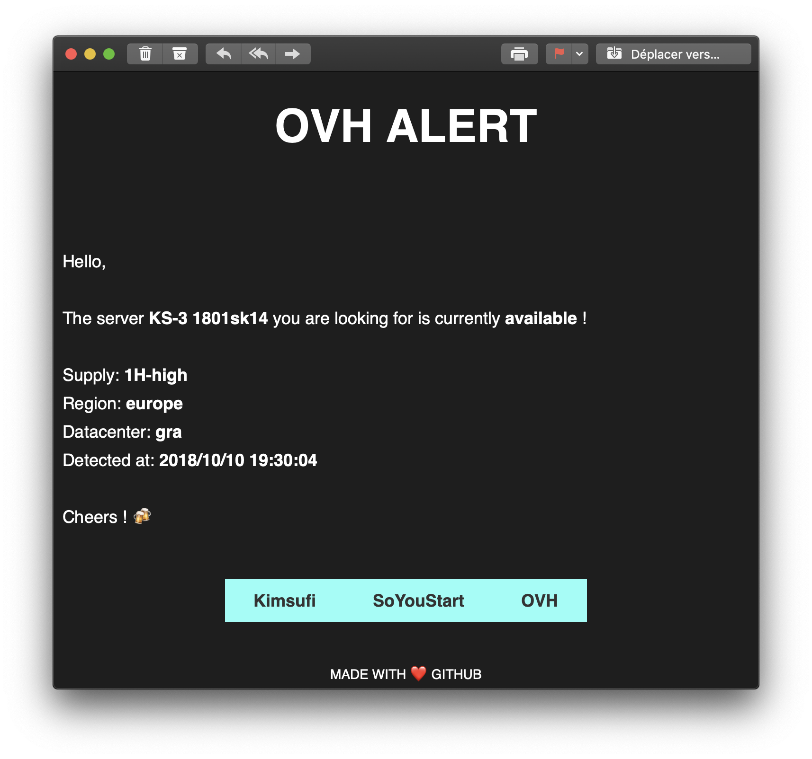

# go-ovh-availabilities

## Summary
**go-ovh-availability** is a cross-platform monitoring tool which aims to alert you from OVH dedicated new availabilities. You can be alerted by mail or simply from the terminal log output.




```shell
$ go-ovh-availabilities -c /path/to/config.json
2018/10/09 20:29:17 Configuration file : config.json
2018/10/09 20:29:18 KS-3 1801sk14 is now : available (1H-low) in europe (gra) !
2018/10/09 20:29:18 KS-2 1801sk13 is now : available (1H-low) in europe (rbx) !
2018/10/09 20:29:18 1801sys45 is now : available (240H) in europe (rbx) !
```

## Requirements :

Mandatory :

* Go (better with latest version)

Optionnal : 

* SMTP server (for mail support)
* Sendmail (for easier mail support) - [Linux-only]


## Usage

```shell
$ go install github.com/mydoom/go-ovh-availabilities
$ vi config.json
$ go-ovh-availabilities -c /path/to/config.json
```

## Configuration

- Refresh (mandatory) is the interval to wait before the next API request. (seconds)
- Wanted.Name (optional) is but generally usefull.
- Wanted.Hardware (mandatory) refer to the "id" of the dedicated server. You can get it from the Kimsufi or Souyoustart website by inspecting the source code.
- Wanted.Region (optional) is the location of the server
- Wanted.datacenters (optional) is usefull if you want a desired DC. Exemple: "rbx" for "Roubaix", "lon" for "London"...

```json
{
  "api": "https://www.ovh.com/engine/api/dedicated/server/availabilities?country=fr",
  "refresh": 300,
  "wanted": [
    {
      "name": "My favorite KS-1",
      "hardware": "1801sk12",
      "region": "europe"
    },
    {
      "name": "backup storage (KS-2)",
      "hardware": "1801sk13",
      "region": "europe",
      "datacenters": []
    },
    {
      "hardware": "1801sk23",
      "region": "europe"
    },
    {
      "hardware": "1801sys011",
      "region": "europe",
      "datacenters": []
    }
  ]
}

```

## Mail Support


### Sendmail (the ugly/easy way)

Add to config.json :

```json
{
  "api": "https://www.ovh.com/engine/api/dedicated/server/availabilities?country=fr",
  "refresh": 300,
  
  "mail": {
    "from": "user@domain.tld",
    "to": "someone@exemple.com",
    "object": "Alert : OVH",
    "sendmail": {
      "active": true,
      "bin": "/usr/sbin/sendmail"
    }
  },
  
  "wanted": [...]
}
```

### SMTP Auth

Add to config.json :

```json
{
  "api": "https://www.ovh.com/engine/api/dedicated/server/availabilities?country=fr",
  "refresh": 300,
  
  "mail": {
    "from": "user@domain.tld",
    "to": "someone@exemple.com",
    "object": "Alert : OVH",
    "smtp": {
      "active": true,
      "server": "localhost",
      "port": 1025,
      "username": "",
      "password": ""
    }
  },
  
  "wanted": [...]
}
```